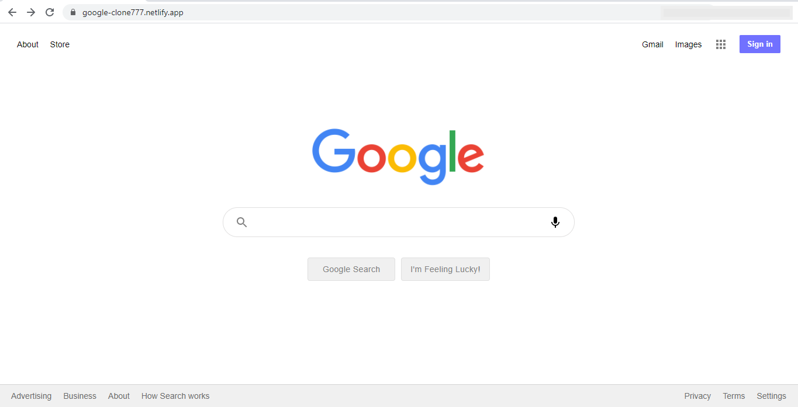
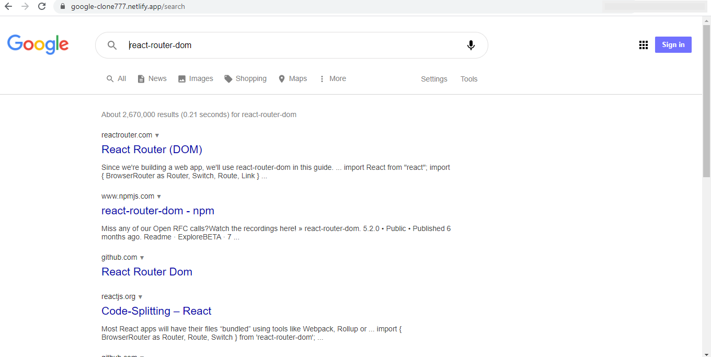

# GOOGLE-CLONE

## [Live demo](https://google-clone777.netlify.app)

### Main Page of Google Clone

### Search Page of Google Clone

## Technologies and Tools:

+ React;
+ React Router;
+ Context API (Redux);
+ [Google Custom Search API](https://developers.google.com/custom-search/v1/overview);
+ Firebase Auth REST API;
+ Material UI.

## Setup:

1. Get the [API Key](https://developers.google.com/custom-search/v1/introduction#identify_your_application_to_google_with_api_key) to identify your application and paste it to './src/keys.js'
2. Get the Programmable Search Engine ID to specify the Programmable Search Engine you want to use to perform this search. Use [Control Panel](https://cse.google.com/all). Paste it to './src/useGoogleSearch.js' in the CONTEXT_KEY.
3. Use `npm i`.
4. Use `npm start`.